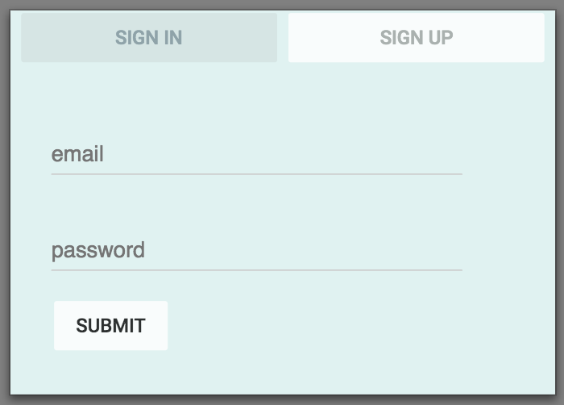
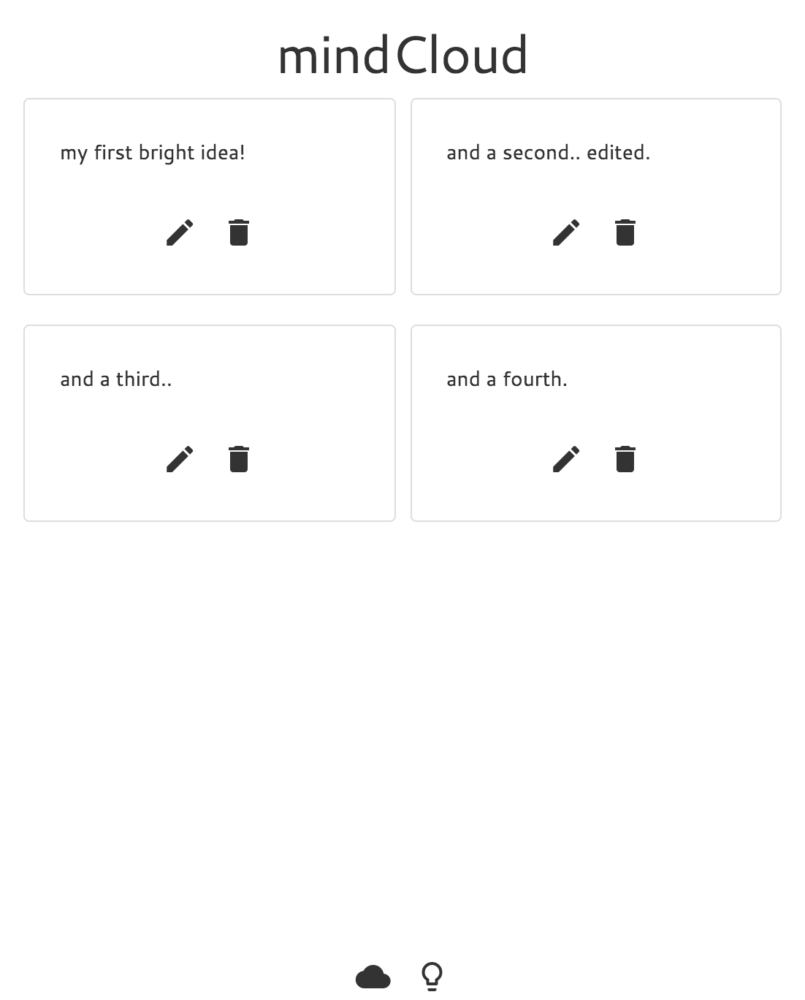

# mindCloud app

Find the app [here](https://danielleletarte.github.io/mind-cloud-client/) 
Find the mindCloud API [here](https://github.com/danielleletarte/mind-cloud-api)

## About the app

mindCloud is a clean and simple way to manage brilliance. Afraid you will forget an important idea? Throw it in the cloud! Create and edit ideas as the evolve, or simply delete them if they no longer serve you.

### How it works

A user must create an account and authenticate to access mindCloud.

Once signed in, a user can see all ideas they have saved under their account.

A user creates an idea by selecting the lighbulb icon. An input form is displayed with options to save the new idea or discard it.

Once an idea is saved, it is dynamically added to the user's list.

Hovering over an idea highlights it, making it easier to navigate a large list of ideas.

A user can edit an idea by selecting the pencil icon for the appropriate idea. An edit form will display with the unedited text.

Selecting the check mark saves the changes and displays the updated idea.

To sign out, select the cloud icon at the bottom of the screen for access to the menu options.

The design is optimized for any size device. Ideas display in multiple columns on wider screens.

## Project Planning

### Approach

 - Before doing any coding, I put together some wireframes and documented the ERD for this project. I decided on a simple one-to-many relationship between users and ideas. I mapped out what I would need for fields on the new resource before moving on.
 - I started with validating the authentication functionality on the back end by creating curl scripts. Authentication was provided in the API already, so this was a natural place to start.
 - I created basic modals on the front end to validate authentication actions were working before moving on to the the basic layout design for the application.
 - I set up the scaffold for the Ideas table and created scripts to validate the routes I would need (outlined in the API README linked above).
 - I created a Handlebars template to grab all ideas and display to the screen upon authentication of a user. I created a second template to be used for rendering a newly created idea to the screen.
 - I moved on to creating the necessary front end buttons to validate create, edit and delete actions from the front end.
 - My biggest hurdle was implementing the Node.js module Salvattore, which creates a very dynamic grid structure. The documentation was spotty and I struggled with incorporating the files locally in the project template we are using.
 - Once all functioanlity was validated, I focused on adding some style to the front end. I added the header and incororated a nicely scrolling ui. I tested the app on different devices and browsers to confirm it was compatible. 

### Wireframes and Models

[ERD](imgs/erd.JPG) 
[Screen Mockups](imgs/screen_mockups.JPG) 

### User Stories

 - As a creative person with lots of ideas, I want a quick and simple way to capture a thought so that I can return to it later if it's truly of value to me.
 - As a user, I want to be able to quickly remove thoughts/ideas that I no longer need.
 - As a user, I want my ideas to display cleanly on any device I use.
 - As a user, I don't want other people to have access to my ideas.

### Stretch Goals

  - (COMPLETED) Incorporate at least one Node.js module directly rather than through CDN.
  - (COMPLETED) Design the app to look good on all devices using responsive design elements.
  - Support the ability to add links a user wants to revisit. Rather than text, a link preview would render to screen.
  - Create a simple unit test that validate high level functionality to support continuous integration methodology.

### Unsolved Issues

 - Introduced a hover effect that highlights ideas as you mouse over them. It should work on touch mobile phones, but I don't reliably see the effect when using the app from my mobile device.

## [License](LICENSE)

1.  All content is licensed under a CC­BY­NC­SA 4.0 license.
1.  All software code is licensed under GNU GPLv3. For commercial use or
    alternative licensing, please contact legal@ga.co.
